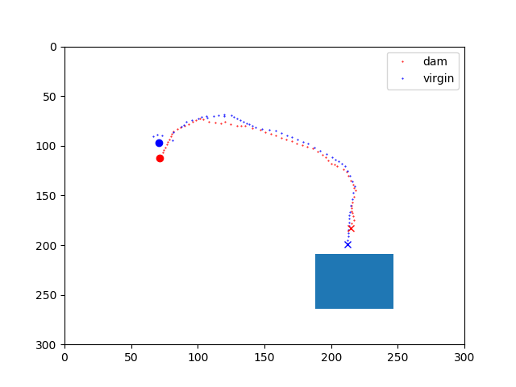
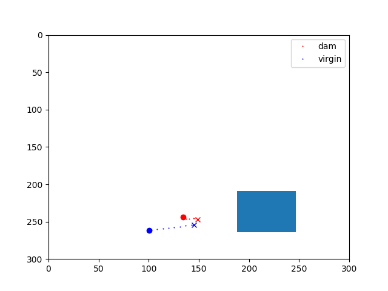
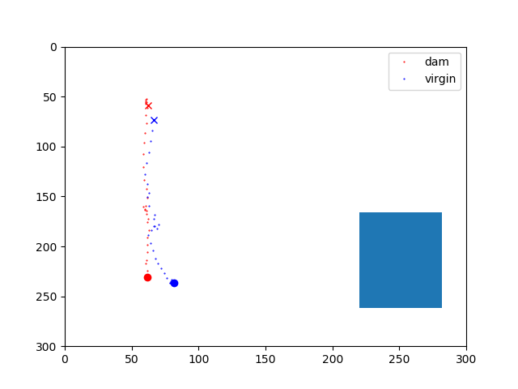
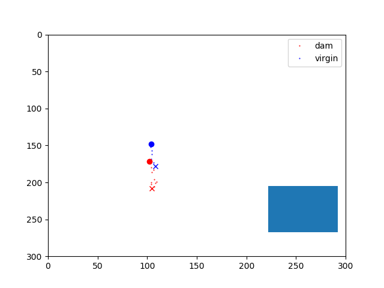
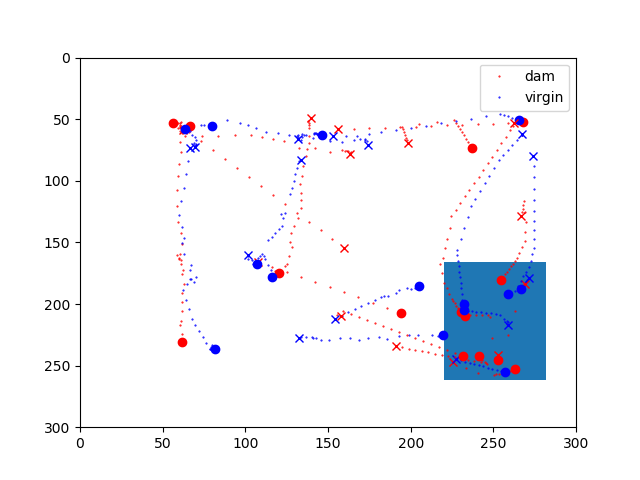

# Meeting Report for August 14th, 2020 (Carcea, Froemke, and Cunningham Labs)

## Data Analyzed:
* RT\_CohousingTemp

This dataset consists of the following videos:  
* TempTrial2\_left.mpg

* TempTrial5\_middle.mpg

* TempTrial7\_right.mpg

* TempTrial8\_right.mpg

* TempTrial9\_left.mpg

* TempTrial10\_middle.mpg

* TempTrial11\_left.mpg

* TempTrial12\_right.mpg

* TempTrial14\_left\_middle.mpg

* TempTrial15\_left\_right.mpg

* TempTrial16\_middle.mpg

* TempTrial17\_right.mpg

Note: TempTrial\_14 was excluded from this analysis because I could not locate a config file for it at the moment. It will be included in future analyses. 
Total analysis time: ~6 hours per video x 11 videos * 3 mice = 198 hours of behavior data.  

## Analysis Conducted:
* Automated video preprocessing, tracking, and custom postprocessing (SocialDatasetv2 module) as packaged on the AWS AMI carcea\_stable\_02\_04\_2020 (ami-0944e125acc999543). This portion of the analysis was performed by Zahra Adahman, who uploaded the datasets with appropriate configuration files. I did not rerun video processing on these videos myself, and started with traces that already existed for the sake of efficiency. 

* Automated extraction of pursuit events. I took the output of the automated tracking pipeline, and isolated out pursuit events where one animal is chasing another. In order to perform this isolation I found all detected pursuit times, took a window around them, and saved this data independently for easy querying. To be somewhat conservative, I further filtered pursuit events (here defined simply by the velocities of both animals) by the following criteria: 1) animals must be closer than 30 pixels at some point in the pursuit event. 2) animal speeds must not exceed 20 units/frame during the pursuit event. I did not include a criterion for being outside the nest, as nests here were fairly loose in construction, and animals could be tracked within them.   

* Single Event Analysis: Plots of each individual filtered pursuit event. I generated figures that plot the start (circle), end (cross) and trajectory of individual pursuit events that also include nest position, like so:  
 

    * Did not exclude events in the nest due to increased visibility. 
    * For each extracted pursuit event, generate compact descriptions of traces, and which animal leads, with visualization.
        * Red indicates dam, blue indicates virgin (throughout)
        * Plot normalized to box size.  
        * Nest indicated as blue rectangle
        * Trajectory starts indicated as circles, trajectory ends indicated as crosses
        * Dotted lines indicate individual tracked points.
        * Caveat: sometimes trace can be misleading in showing which animal pursued which other.
    * Result: We can capture virgin pursuits reliably:

See slides for accompanying video. 

### Single Event Analysis TODOs: 

* quantify the number, proportion of these events over successive days. 
* Streamline/improve accuracy of detection. Some small portion of events is still due to one animal being occluded, or poking head through holes in box (which Zahra/Ioana says is to feed.) 
* Seem to be shorter in general than traditional shepherding events. Can we capture this difference statistically? 
* Make use of existing framekworks for classifying aggressive behaviors (see Anpilov 2020).
* Compare to general movement features in datasets with tethered animals. 

* Large Scale Analysis: Quantification of pursuit events over longer time bins. 
    * Considered time bins of 40 minutes, and aggregated all pursuit events found during that time. 
    * Optimal to look for patterns in bouts of interactions. 

See slides for more details. 

### Large Scale Analysis TODOs:

* Check against manual scoring. Can we quantify successful vs. failed shepherding as a metric of dynamic interactions? 
* Can we quantify the spatial distribution of these events? (Starts,stops,trajectories). 
    * Different Ethological Drives?
    * Territoriality?

## Overall TODOs:
* Validate filtered pursuit events against manual scoring to make sure we are counting correctly.
* Validate virgin agonistic chasing against different metrics of aggression. Calculate differences between these events and shepherding. 
* Distinguish successful and failed shepherding events as a time varying metric. 
* Quantify the occurrence of virgin shepherding, dam agonistic chasing. 

