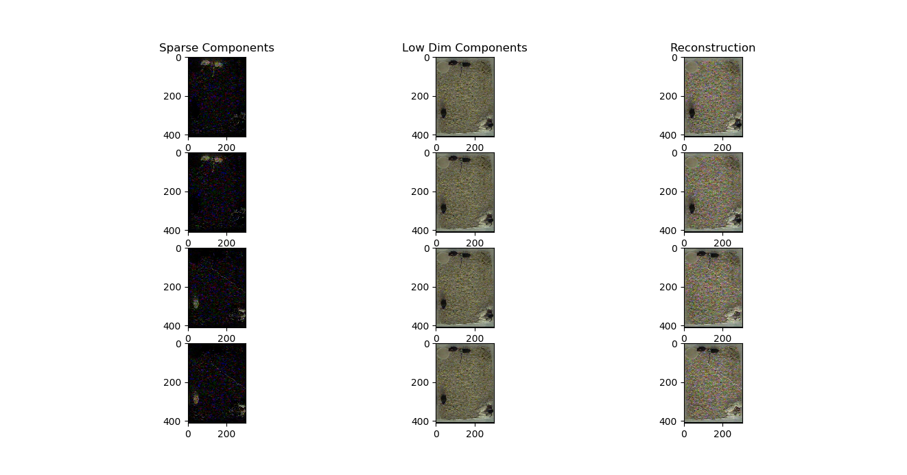

# Testing RPCA based foreground segmentation on Froemke/Carcea Data. 

I ran a preliminary test of RPCA using the implementation of Principal Component Pursuit provided by the onlienRPCA package. As an initial run, I just provided four training frames (frames 1-4) of the training data, each of dimensionality 410x300x3. We created a data matrix M of shape (410x300x3,4), and applied RPCA (scripts/rpca_experiment.py). The results can be seen in the image below:  

On the left, we see that the recovered sparse components are able to accurately segment out the locations of the mice in each training frame, if not their appearance (after all, we are considering this as an additive model). We see that the learned low dimensional components actually include all possible locations of the mice, and prefer to learn the sparse components as subtractions. This is likely because the mice themselves are so close to black that the optimization works better this way. We might want to consider using this with a 0-1 flipped image instead if this is going to be annoying. It would be interesting to see if the solution switches to considering the true static background when we have enough frames.   

Interesting future directions: 
- [ ] How do we make this faster? Look into the online implementations, svd solver (https://github.com/wxiao0421/onlineRPCA). 
    - [ ] The code for the offline implementations is done entirely with numpy. This makes it available for just in time compilation, and potentially gpu acceleration via libraries like JAX and numba. This appears to be pretty simple, and GPU accelerated SVD in particular should be available through JAX.   
- What if we only use one channel? Could this further speed up analysis without hurting performance?  
- How does this compare to neural network approaches? (speed, performance)
- Is there room for improvement in what people have considered?  

Update 3/8, 12:34
It turns out that accelerating this computation by using GPUs is not necessarily a good option. It looks like using GPUs we run into OOM issues very quickly, while using the 8 cpus on the p3.2 machine we actually do get a substantial increase in performance. We can revise our future directions as follows: 
- multi core parallelization through numpy seems like quite a good option. We can probably extend this by using JAX just in time compulation on the update step internally.  
- How much does the multi-core benefit help us? We should time this. 

Update 3/8, 4:05
We tried working with JAX. Bare jax does seem to provide a speed up of 30-50% (just looking at overall compute time). I tried to use Jit as well to submit the whole inner loop, but unfortunately the dependence of the algorithm on the rank of the matrix makes it impossible to jit via JAX- all possible implementations, whether by truncating the matrix or taking a dynamic slice and assigning to 0, change the shape of an array (https://jax.readthedocs.io/en/latest/notebooks/Common_Gotchas_in_JAX.html).  

I also tried jitting this whole inner loop via numba, albeit with significantly less time taken to read the documentation. It fails at the first in place assignment (`M[unobserved] = 0`), and complains alot about external functions.  

I'm now trying to run RPCA on the entire sequence of training frames from the original training set (frames 1-100). I expect this to take a while- for some reason the CPU process utilization looks to be much lower than when the first four frames were being analyzed. It's probably worth examining how fast these updates go with tqdm.  

- it could be worthwhile to jit those parts of the code that are not dependent on the rank- worth looking into in the future.  
- look into alternatives. 
    - There are some nice looking online algorithms for this. OR-PCA, in particular seems pretty well principled as an approach here. Try testing this out. 
- An interesting approach could be to initialize your background estimate from the training set with batch RPCA, and then update on videos with ORPCA. Read this paper thoroughly, as it seems like a great use case for your dataset in particular (we don't expect slowly changing subspaces, nor change points.)
- Reach out to Ian about SVD implementations. Maybe there is something smart we could be doing here to improve performance. 

After training on the whole dataset, the resulting training frames and background look like this: 

image here. 

In general, this has been a good lesson in 1) reviewing your linear algebra, and 2) the implementation complexity of optimization algorithms that depend upon cpu/gpu. 

