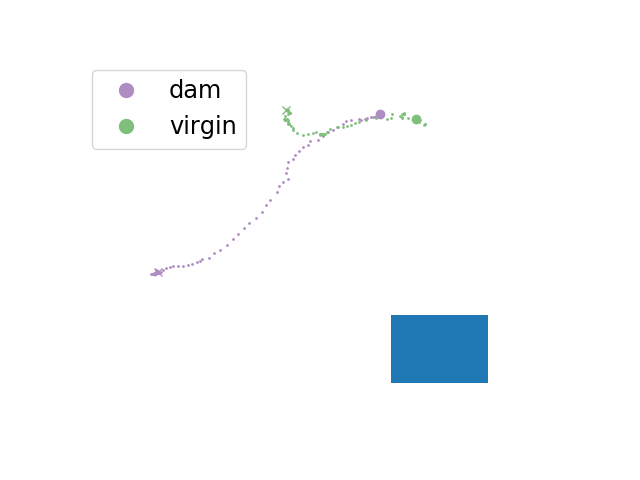

Script documentation for file: explore_freq_methods, Updated on:2020-09-15 23:45:44.032982
==========================================================================================

# Summary

This script is meant to explore the effect of frequency based methods on the kinds of traces that we care about. We will show how to implement the fourier transform, obtain the power spectrum, and reconstruct these trajectories with a low rank approximation. All of these methods will be handled by the `social_pursuit.fft.PursuitFFT` object.
## Candidate dataset
  

