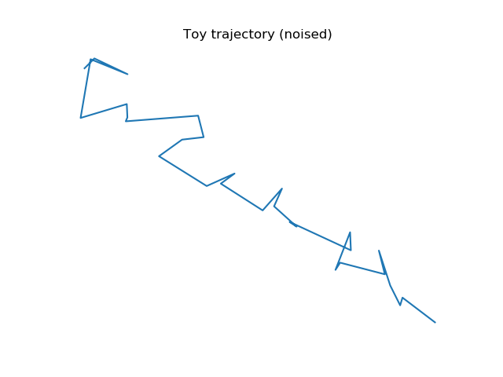
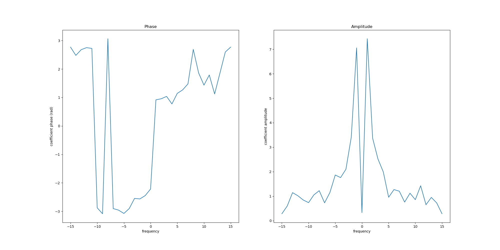
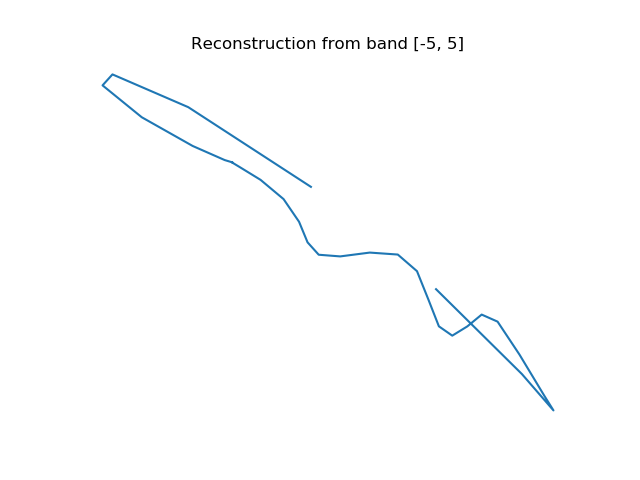
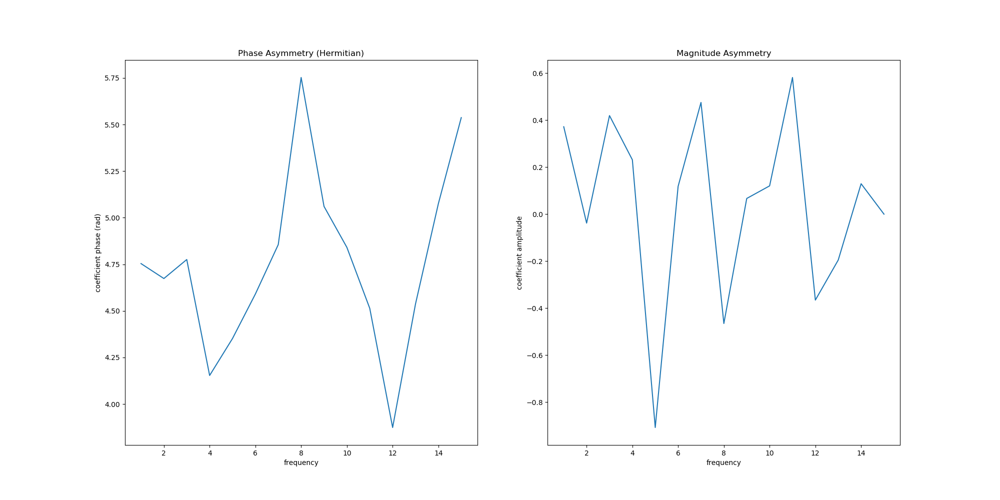

Script documentation for file: explore_freq_methods, Updated on:2020-09-22 12:17:14.556476
==========================================================================================

# Summary

This script is meant to explore the effect of frequency based methods on the kinds of traces that we care about. It follows the approach of papers in air traffic control (Annoni et al. 2012) and ecology (Polansky et al. 2010) to apply frequency based methods to the study of real, two dimensional trajectories. This approach could complement and provide foundations for our current data analysis techniques, and gives us nice ways to characterize trajectories of different length.  We will show how to implement the fourier transform, obtain the power spectrum, and reconstruct these trajectories with a low rank approximation. All of these methods will be handled by the `social_pursuit.fft.PursuitFFT` object.
## Basic Properties of the trajectory FFT

### Amplitude and Phase representation

First, we try applying fourier transforms to a straight line segment that aligns with y = -x.  

    

We generate a fourier transform for this trace by projecting the y axis to the imaginary plane, and treating the trace as a 1-d complex signal.  

    

On the left, we can see the phase content of the fourier transform, ordered by frequency. The phase component determines the 'initial conditions' for each frequency value. Moreover, for we can see that (despite the discontinuities introduced by the range (-pi, pi)), the coefficient phases at the negative and positive frequencies have the same slope. By applying a rotation to all of these phases, we can similarly rotate the trajectory in space (because the Fourier Transform is a linear operation). We can separately examine the amplitude content to the right. The existence of positive and negative frequencies indicate components that rotate in opposing directions. Symmetry between the positive and negative frequencies indicates straight trajectories, or trajectories with an equal and opposing amount of rotation to the left vs. the right. Note that when we have an even number of input points, the resulting fft representation gives the positive and negative nyquist frequency as a single term, leading to apparent asymmetry. We have symmetrized the representation here for purposes of visual depiction. Note that because 1) the FFT is linear and 2) spectra throw away all rotational information, the spectrum of the FFT will be identical regardless of the rotational orientation of a trajectory. 
### reconstruction

One very useful property of the transform is the ability to analyze and decompose the trajectory into movement on different scales. Consider what happens when we work with the same trace, but corrupted by random gaussian noise of magnitude 0.05  

    

We can then examine the fft of this noised data:  

    

We can see that the resulting phase and amplitude diagram are significantly altered by the noise (and are notably no longer symmetric). Since we know that much of the fluctuations are at a small scale, what happens if we just discard the small scale information by zeroing trajectories below a certain threshold?  

    

This reconstruction was performed by zeroing the fourier coefficients outside of the range [-5, 5]. It is not a great reconstruction, but one can see that it preserves the general shape features of the trajectory well. This is a good basis for featurization, if not for outright reconstruction.
### Asymmetry analysis and symmetrization

Finally, we want to take a closer look at the asymmetry between the positive and negative frequencies of the fourier spectrum, which indicates overall rotational trends.  

    

We motivate this analysis from the idea that the FFT for a purely real trajectory is Hermitian: F(-x) - F*(x). This means that for our trajectories, where we project the y coordinate to the imaginary plane, any trajectories that are purely horizontal will have a amplitude and phase difference of zero (when measuring relative to hermitian symmetry.) Any straight lines will therefore have an amplitude difference of 0, and a constant phase difference across all trajectories. We can confirm this visually in the plot above (note the scale on the y axis.)

Let's see what happens when we measure this same asymmetry for our corrupted trajectory.   

    

We see that the difference measures fluctuate around the true values given above.
## Candidate dataset

We will pilot these analyses on a candidate pursuit instance whose filename can be found in the accompanying script.  

    

We will focus on the dam's trajectory in subsequent analyses (shown here in purple)

First, we can generate a fourier transform of the data. We do so by first projecting the y axis of the data to the imaginary axis, treating the two dimensional dam's centroid trajectory as a one dimensional complex trajectory. Here we show the spectrum of the dam's centroid trajectory, discarding the phase information for ease of presentation.  

    

This representation shows that there is a sharp peak in the frequency content of this trajectory in frequencies close to zero. This means that relatively slow frequencies dominate the activity that we see, setting us up to reduce dimensionality by considering only the low frequency activity in further analyses.

We can also apply an inverse fourier transform to reconstruct the data back from this frequency representation:  

    

One important thing we want to do with these datasets now is to cluster them. In order to do so, we should figure out which invariances we care about. For example, by disregarding the 0th component of the fourier transform, we can translate all trajectories back to be centered at the origin, allowing for comparison only of the morphologies of the resulting trajectories. 