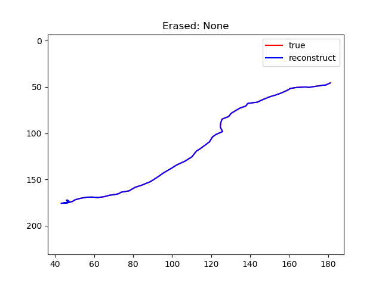

Script documentation for file: explore_freq_methods, Updated on:2020-09-16 00:43:28.007349
==========================================================================================

# Summary

This script is meant to explore the effect of frequency based methods on the kinds of traces that we care about. We will show how to implement the fourier transform, obtain the power spectrum, and reconstruct these trajectories with a low rank approximation. All of these methods will be handled by the `social_pursuit.fft.PursuitFFT` object.
## Candidate dataset

We will pilot these analyses on a candidate pursuit instance whose filename can be found in the accompanying script.  

    

We will focus on the dam's trajectory in subsequent analyses (shown here in purple)

First, we can generate a fourier transform of the data. We do so by first projecting the y axis of the data to the imaginary axis, treating the two dimensional dam's centroid trajectory as a one dimensional complex trajectory. Here we show the spectrum of the dam's centroid trajectory, discarding the phase information for ease of presentation.  

    

This representation shows that there is a sharp peak in the frequency content of this trajectory in frequencies close to zero. This means that relatively slow frequencies dominate the activity that we see, setting us up to reduce dimensionality by considering only the low frequency activity in further analyses. 

We can also apply an inverse fourier transform to reconstruct the data back from this frequency representation:  

    

