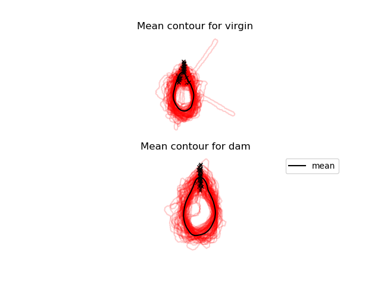
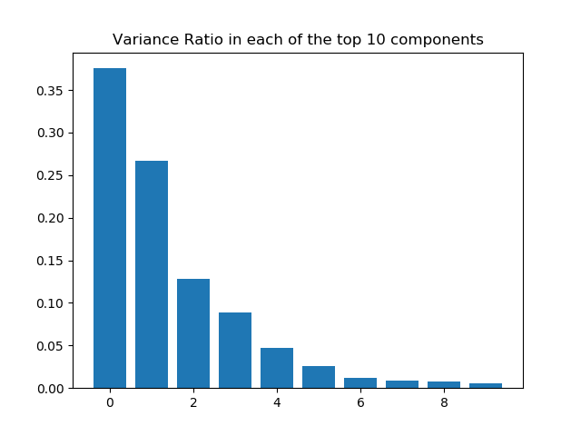
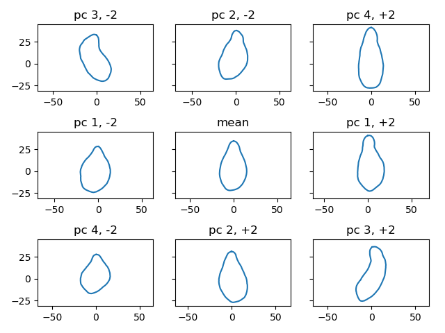
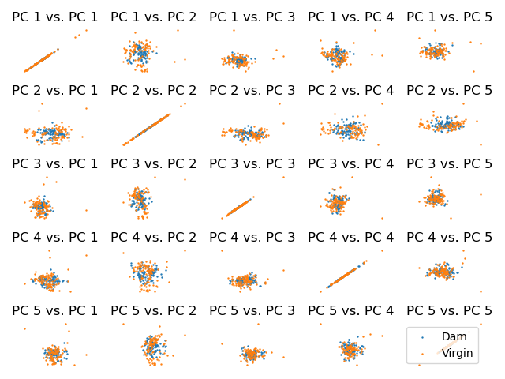
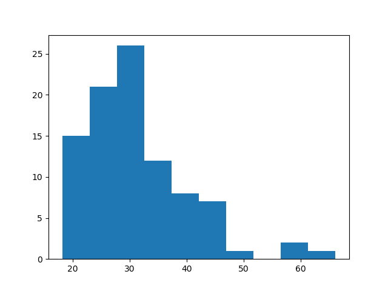
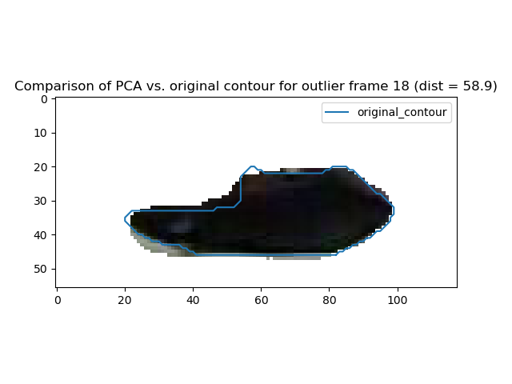
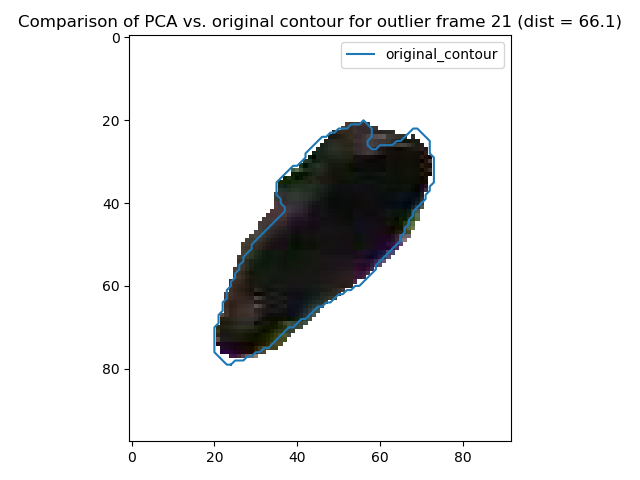
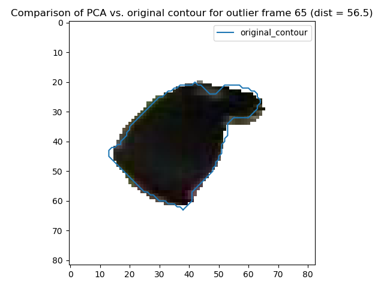

Script documentation for file: from_contours_to_shape_model, Updated on:2020-10-26 17:05:02.099369
==================================================================================================
 
  
**parent file: [summary_week_10_9_20](./summary_week_10_9_20.md)**  
**prev file: [get_statistical_shape_model](./get_statistical_shape_model.md)**
# Summary

We can use the contours extracted by [the previous file](./get_statistical_shape_model.md) to create a shape model. Let's focus for now on creating shape models for the dam, as this is the most reliable.   

We first calculate the mean shape for both animal contours from the training data. Note how reasonable this mean shape looks despite known issues: the existence of the wand, the fact that we lose part of the virgin's head sometimes. We indicate with black x marks the starting point of the contours. We have to believe that we will only get more refined contours as we keep working with this data. Beyond cleaning up the preprocessing, one interesting possibility would be to perform data augmentation by symmetrizing the original contour dataset. We will revisit this later on in this same document. For now, let us explore the shape space we have generated using principal components analysis.

We will now describe the pc space spanned by our training dataset of shapes. We will first construct this pc space, then we will consider the shapes generated at specific loadings.

Upon application of PCA, we see that the data seems inherently low dimensional, with the first 10 components capturing 96.84 percent of the total data variance for the dam. Below, we show the proportions of the variance in each of these eigenvectors:  
  
It is apparent that the data variance is realy concentrated in the first 4-5 eigenvectors.

We can further characterize this data by exploring the pc space of shapes. Here, we have depicted a grid of the mean contour once again (center), as well as perturbations in the top four eigenvectors. We have scaled these perturbations by the square root of each corresponding eigenvalue, and depicted shapes at two of these units removed from the mean.  

We can see that the first principal captures leaning to the left or right, with a potential displacement of the centroid as well. The second principal component seems to capture elongation and shrinking. PC 3 and 4 seem to capture these behaviors, but at more extreme deformations. Note that the orthogonality of PCs is applied in the space of fourier descriptors, which may lead to non-orthogonal seeming deformations of the shape. However, all of these shapes appear to capture real deformations of the mouse contour- we can explore this hypothesis further by looking at the distribution of points in PC space. Although it is not conclusive, we can compare the distribution of the dam's positions to those of the virgins in terms of pc weights, and look at the distributions comparatively- we see that the virgin distribution has a much higher proportion of outlier points, that most likely correspond to frames where the wand has not been captured, or there are issues with the headplate. We will examine these noise hypotheses more closely later.  

If we refit some of the recovered weights to the original images and contours, we can evaluate how well pca based contours recover the true data.

First, we can evaluate a distance metric between the original contour shape and the new contour shape across the entire training set. The distance used here is closely related to the procrustes distance: a euclidean norm on shape keypoints assuming optimal translation and rotation between the two shapes. In our case, we fix translations and rotations to respect the labeled marker points from DLC, instead of aligning the shapes directly. This can be thought of as a lower bound (?) to the procrustes distance (can you prove this?)  

We see that in general, the distance distribution clusters in the range of 20-40 units, with a few outliers. Let us examine these outlier frames in more detail:  
  
  

We have plotted here three outlier frames, with the original contour given in blue, and the pca reconstruction providing the silhouette of the actual image. It appears that the PCA reconstruction acts as a smoothing operation, and does not in general remove key features of the original image. 