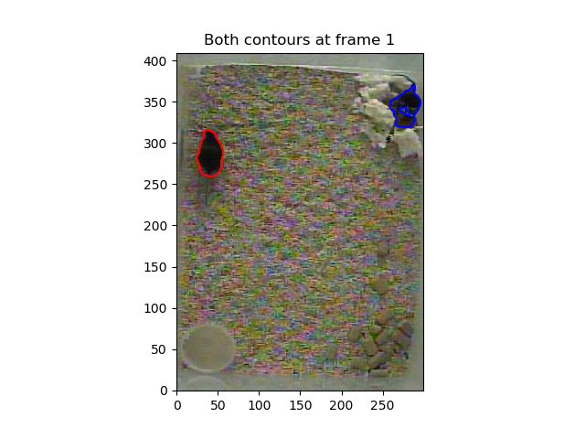
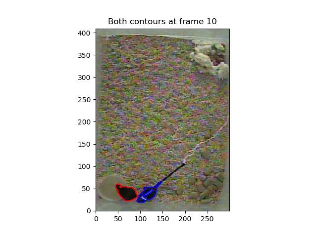
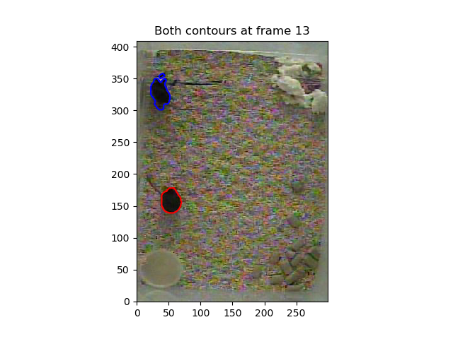
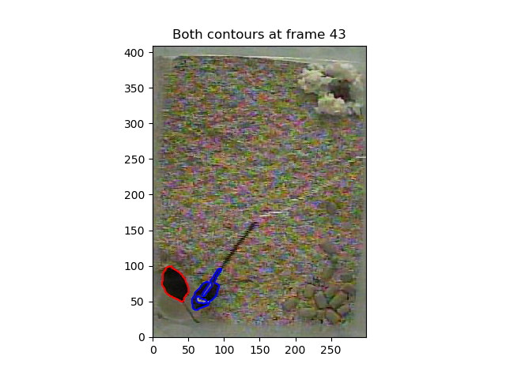
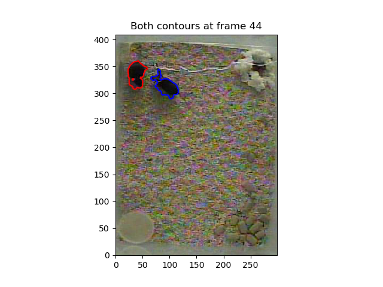
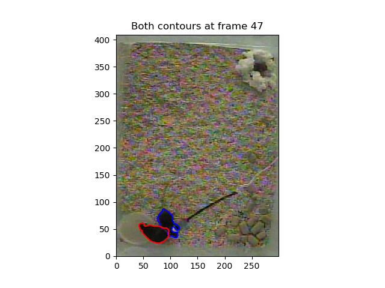
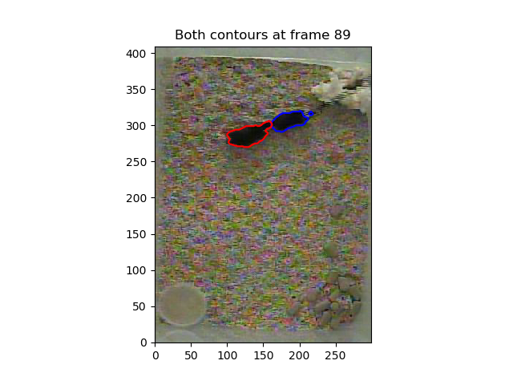
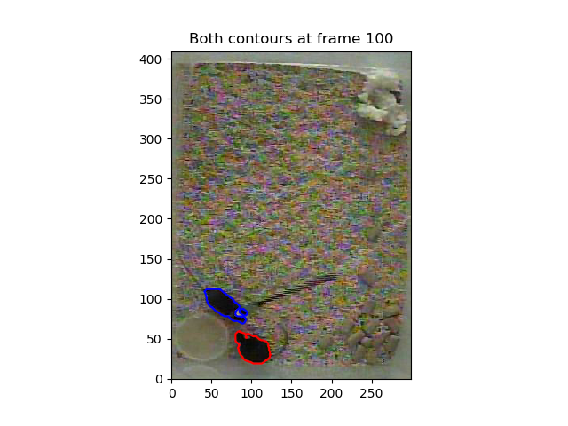

Script documentation for file: get_statistical_shape_model, Updated on:2020-10-23 18:49:41.176273
=================================================================================================
 
  
**parent file: [summary_week_10_9_20](./summary_week_10_9_20.md)**  
**next file: [from_contours_to_shape_model](./from_contours_to_shape_model.md)**
# Summary

We will incorporate the training data into our work through the use of a statistical shape model: a model of the contours of an object, encoded low dimensionally through fourier features. It is known that a small proportion of fourier features is sufficient to encode many contours that we may be interested in. Once we have a collection of fourier features per set of object edges, which can then be manipulated to introduce various invariances. We can then look at the covariance of different shape parameters, and create a low dimensional, statistical representation of possible object shapes. Shape models are popular in biomedical imaging data, and even old approaches have shown that it is possible to create shape models that are well constrined by both the underlying image, and user defined boundary points (Neumann et al. 1998). We will apply this framework to our DLC training data, automatically detecting animal contours with python computer vision, and build a model that is also informed by our markers.

We start off with some computer vision. We would like to segment out the positions of our two mice, so that we can then construct contours of their positions. One effective way to do this is with the watershed algorithm, which mimics 'flooding' from a set of user-defined marker points, and considers the resulting basins as contiguous objects. This setup gives us a nice way to plug in our DLC training markers into an image segmentation problem: we define a skeleton of points from our markers that certainly belong to a given animal, and apply the watershed algorithm from there. For our purposes, the marker skeleton looks like this:   

Now we apply the methods of watershed segmentation to our images. First we will threshold our image to create a binary mask. Then we will remove small holes and dots with morphological opening and closing. Then we will apply the watershed transform, with the skeleton shown above on the distance transform of the binary image. This procedure effectively separates the animals from the background, and from each other in most cases. For more info on the watershed transform, see [here.](https://scikit-image.org/docs/dev/auto_examples/segmentation/plot_watershed.html)  
  
  
  
  
  
  
  

We achieve good performance on most frames in the training set, but we can further refine the results by manually indicating lines indicating lines in the training frames that beling to one animal or another, and adding these to the skeleton. This is achieved via the `LabeledData.save_auxpoints` function, which opens up a bare-bones gui for the user to label. We can see the value of this in an example frame. Before interactive segmentation:  

Compare to after interactive segmentation (see different markers in bottom left)  

We can further improve the quality of detected points by applying a median filter:

It's also possible to remove the hole in the head by applying a gaussian convoluion and rethresholding. I'm still thinking about the best way to merge across the head barrier/merge unconnected contours when they occur.  

By default, we blur the reference image with a sigma = 0.7, and apply yen thresholding afterwards.

Finally, we can extract the contours for these images:

This is a big point, so we will show all of the contours that we have extracted so far.  
  
  
  
  
  
  
  
  
  
  
  
  
  
  
  
  
  
  
  
  
  
  
  
  
  
  
  
  
  
  
  
  
  
  
  
  
  
  
  
  
  
  
  
  
  
  
  
  
  
  
  
  
  
  
  
  
  
  
  
  
  
  
  
  
  
  
  
  
  
  
  
  
  
  
  
  
  
  
  
  
  
  
  
  
  
  
  
  
  
  
  
  
  
  
  
  
  
  
  
  

We will take these contours, and create fourier descriptors out of them next in the file [./from_contours_to_shape_model.md](./from_contours_to_shape_model.md)