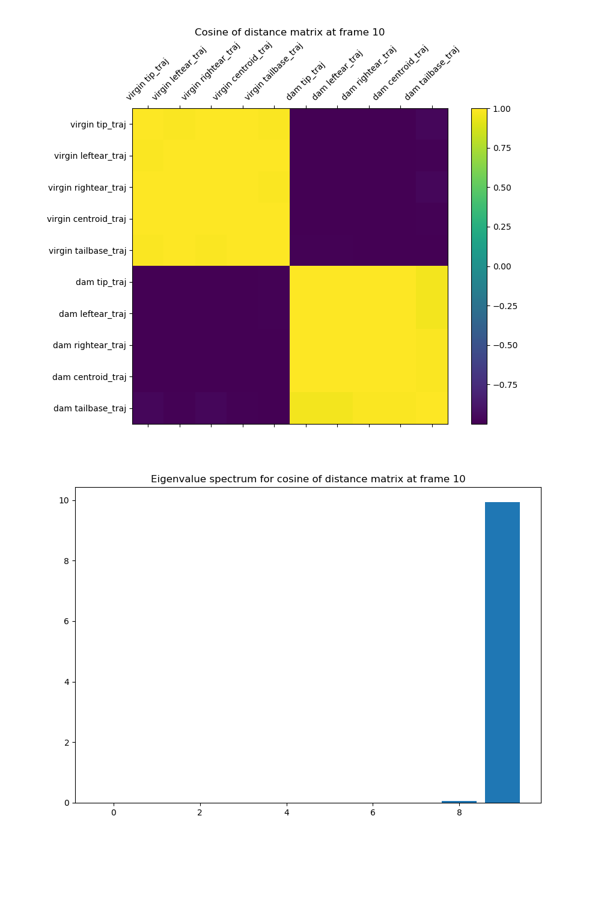

Script documentation for file: polar_classification, Updated on:2020-10-09 18:35:51.060904
==========================================================================================

# Classification based on hierarchical polar representation

Describes a multi-step classification process for detecting false/missing body parts. We start with the angle representation we showed in the [polar representation](./polar_representation.md) file:  

    

The first thing that we will do will be to infer identity assignments based on these angles. If we look at the angles at a representative time point (see a slice of the first figure), they clearly cluster into two distinct groups at most times, indicated by the color of the angle. We want to quantify this clustering in some easy to characterize way. Importantly, we would like to be able to tell when data is not well clustered into two categories without invoking a large computational overhead- this corresponds to the case where all detections actually correspond to a single animal. Although we could enlist a variety of clustering algorithms (gmm,k means, etc), the clustering seems well defined and small enough that these methods would be overkill. To start, consider constructing a distance matrix between the angles for the polar representations of different body parts. The values of this matrix are cos(d$\theta$), where $\theta$ is the cosine of the difference angle between the two detected body parts. Our approach is related to spectral clustering (see bibliography); and we might consider working directly with a Laplacian matrix instead of our current one if we want more clusters/cleaner results. This metric can be interpreted as the covariance between body part vectors projected to the unit circle centered on the mean position.  

    

We can see that there is one large eigenvalue, and the rest are of negligible magnitude. Quantitatively, it captures (99.3%) of the total variance. If we examine the corresponding eigenvector, it has values follows:   
  

|v_1|
| :---: |
|-0.3159867504539429|
|-0.3170462183054421|
|-0.31625899656824286|
|-0.3171072613374507|
|-0.31672665250783344|
|0.3161389471052013|
|0.31619117817413933|
|0.3172927375842804|
|0.317116239789893|
|0.312383486422577|

The largest eigenvector cleanly separates the body parts of the two animals.

Now if we choose a frame where the two animals are not cleanly separated, we get the following plots by comparison:   

    

The corresponding eigenvector correctly assigns the dam's tail trajectory to the virgin animal. The largest eigenvalue still captures (99.5%) of the total variance.  
  

|v_1|
| :---: |
|-0.31605643424659546|
|-0.3168268517669538|
|-0.31671207199122686|
|-0.3157622078620482|
|-0.3157808283031078|
|0.3158987180173569|
|0.3166595505734797|
|0.3167936727647931|
|0.31636101922378346|
|-0.31542263676780513|

Finally, let's consider what happens if we simulate a time point where all of the points correspond to detections on a single animal (see below)  

    

  
If we apply these same methods to this simulated trajectory, we get the following:  

    

  
We can see that when our detections are degenerate, the distance matrix we constructed does not concentrate its signal as heavily in the largest component. In this case, we get a non-trivial contribution to the second eigenvalue as well. The top two eigenvectors account for 77.2% and 22.7% of the variance, respectively , with the corresponding eigenvectors:  
  

|v_1|v_2|
| :---: | :---: |
|-0.35775948227061277|0.06895307207245176|
|-0.21294753110586598|0.5347562949893728|
|-0.2815890188850078|-0.4128681021011938|
|0.3557469449506944|0.09818624739896045|
|0.3556339698715891|-0.09956907952805899|
|-0.3592349392094409|0.033984099350139955|
|-0.2013855489661925|0.5497859229012784|
|-0.27098847973747964|-0.43633850656332335|
|0.35097182592319|0.14533832446680534|
|0.3579327552667758|-0.06582224103016128|
  
Already, we can see that two important quantities for clustering will be the magnitude of the given eigenvalues, and the entries of the corresponding eigenvectors.  
Many spectral clustering methods are based on the idea of partitioning a dataset based on the values of a given vector. Let's take inspiration from this, and cluster based on the sign of the entries in the top eigenvector.  

    

  
We can use this representation to build an anomaly detector. First, let's detimerine the locations where we have failed to detect an animal. We can detect points like this by constructing a _score_ _vector_ (ones for dam body parts, negative ones for virgin body parts), and looking at the dot product of this score vector with the sign of the top eigenvector of our distance matrix. If this dot product is 10, this means that animal body parts are correctly clustered in the way we would expect in this distance matrix. This procedure asks the question, how much does large scale structure in our distance matrix reflect what we would expect given that they belong to body parts on two different bodies?  

    

  
Overall, applying this criterion eliminates 23.2% of the example trajectory analyzed here from further consideration.

What we need is a way to exclude those states where we're only tracking one animal.

Next, we should confirm that the eliminated points actually check out. construct a within animal distance matrix, and record the statistics of it. Consider that what we're doing here is like 'second level' classification, we could do better by going down a level.  
we can see that the inner product of the sign vector with an identity preserving vector gives a good general characterization of the accuracy of detected poses. See [here ](./images/)for examples of good and bad clustering, in folders marked (exampleimages_score_[score]). Notably, we see that there are edge cases where we would not be able to reliably extract out meaningful pose information from the model, because we can only localize one point to either the virgin or dam. For example, see [this frame](./images/exampleimages_score_0/frame1508.png) or [this frame](./images/exampleimages_score_0/frame1509.png) or [this frame.](./images/exampleimages_score_0/frame274.png)
- Concrete Todo Points
    - 00), Make a habit of checking your master plan.
    - 0) estimate the distribution of part lengths in the score = 10 portion of the dataset.
    - 1) can we estimate the trajectory of individuals accurately, even if we lose some points? To do this, we could estimate the distribution of the mean given all other body parts. Do we need smoothness again for this?
    - 2) can we reconstruct bodies?

From the progress we have made so far, we can write down an algorithm for part resolution.
1. Get mean position from all marked points 
2. Cluster other body parts based on partition given by mean position
3. Evaluate cluster formation, and detect outlier frames where marker points are not reliable (0 or 1 detections for a single animal)
4. For reliable frames, calculate per-identity distance matrices + image contours through conditioning
5. Do within-animal hypothesis testing on part distribution AND image contours to detect anomalous parts
6. Evaluate fit of anomalous parts to other animal through distance matrices + image contours.
7. for outlier frames, search with image contours/rerun DLC on detected contours.

In this algorithm, steps 1-3 can be thought of as initially resolving the identities of the two animals. Steps 4-6 can be thought of as resolving the features/parts of these detected identities, and potentially revising detected identities based on this fit. Note here that we will use animal contours in addition to detected points, which is a new innovation. If this approach bears out, we may wish to use the image contours as the primary animal representation, instead of the marked points themselves.