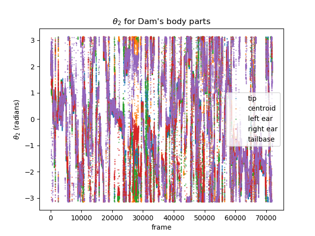

Script documentation for file: polar_representation, Updated on:2020-09-25 15:05:14.363327
==========================================================================================

# Summary

This script explains idea for a new way of representing our dataset using a hierarchical polar representation. This idea is in part inspired by the literature from robotics (think of linkage models). The representation works as follows: First, take the average of all detected mouse body parts. This should be a point between the body parts of both animals. We will represent this average point in polar coordinates. Now, the positions of individual body parts can be recovered relative to this average point, again in polar coordinates. See below, where we give the representation of the centroid coordinates only:  

    

Here, the coordinates $\l_1,	heta_1$ give the location of the mean, while $l_2,	heta_2$ give the location of the dam and virgin positions, respectively. The value of this representation is that it cleanly separates the representation of the two mice, or it should in the case where detections are correctly assigned. Let's see what happens when we examine $	heta_2$ for all coordinates, not just the centroid, as a function of time:  

    

Seeing $	heta_2$ coordinates for the dam's body parts reveals points in time when the body part angles are fairly close together and smooth, and others when they are very discontinuous. In this representation, it is difficult to tell when the discontinuities are from the periodicity of the representation and when they are from the data: see below for a colormap of both mice, which preserves periodicity information.  

    

A good next step would be to characterize the clustering of these angles through time. We can come up with a criterion for when we are correctly tracking two animals at all, and when we degenerate to tracking the body parts on just one. From this, it might be possible to reconstruct trajectories at various different levels.
## Error detection and Reconstruction

We need a good policy to handle errors in the raw DLC tracking data. This policy should distinguish error cases where we have switches from those where we have completely lost the position of an animal, and treat them differently. Let's first come up with a classifier that determines when traces are clean, when there are switches, and when an animal is wholly missing.