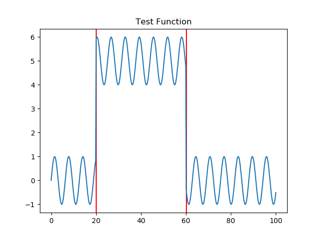
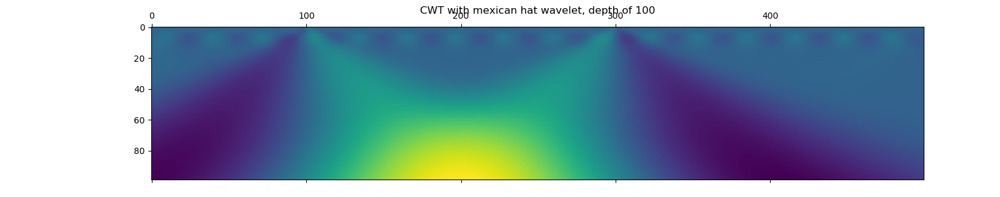
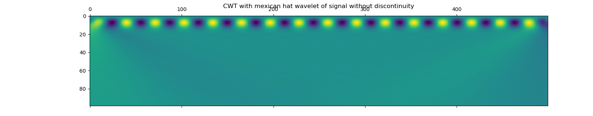
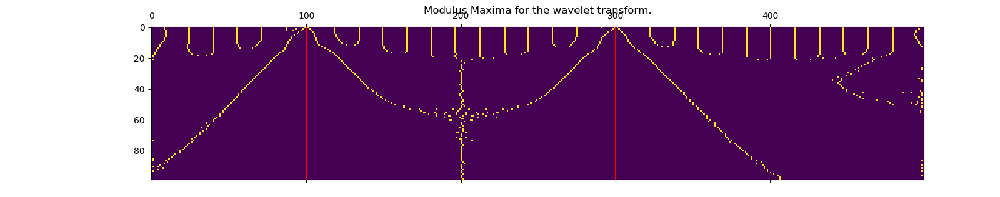
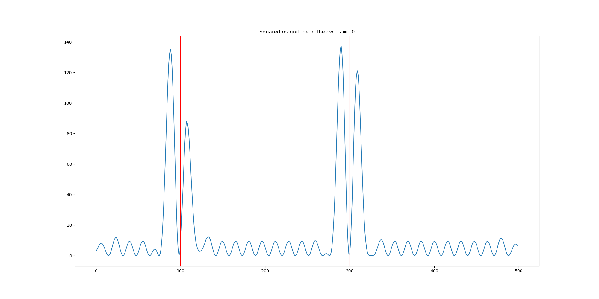

Script documentation for file: singularity_detection_example, Updated on:2020-10-12 22:58:52.467764
===================================================================================================
 
  
**parent file: [summary_week_9_25_20](./summary_week_9_25_20.md)**
# Summary

This script consolidates results from the field of _singularity_detection_, a field of signal processing that uses wavelet transforms to localize and characterize discontinuities in signal data. Originally discussed in Mallat et al. 1992, this field is largely concerned with the analysis of real signals in one dimension, and image edges in two dimensions. Singularity detection with wavelets can form the basis for denoising (Tsung et al. 199, Mallat 2008), discontinuity characteriation (Struzik 1999, Bigot 2005), sparse representations (Dragotti et al. 2003). There have also been extensions to complex domains (Tu et al. 200_), that show promising results with contour detection.

The fundamental idea is that we can use wavelets with vanishing moments (gaussians, derivatives of gaussians) as ways of 'factoring out' the well behaved, polynomial approximable part of a test function, leaving behind only a measure of its intrinsic roughness as measured by a Lipschitz (Hölder) constant. (Mallat 2008, Theorem 6.4) This measure is local, but its signature is distributed across the many scales given by the wavelet transform. It is shown that by tracing the maxima of the wavelet transform in time-scale space, one can localize discontinuities. Furthermore, by measuring the value of these maxima, one can estimate characteristics of these discontinuities (namely, the Lipschitz constant, by virtue of a log-linear relationship between the scale and the Lipschitz constant.) This method is called the Wavelet Transform Modulus Maxima method. In general, it works only for isolated discontinuities, as opposed to oscillating ones, but methods have been mae to characterize oscillating discontinuities as well, both locally with the assistance of model-based statistical estimation (Struzik 1999) and globally across a signal, in the context of multifractals (Mallat 2008, Section 6.4). Interestingly, the math of global signal characterization for dense discontinuities is the same as that for the replica method in statistical physics (partition functions, legendre transforms, etc.)

For this document, we will demonstrate the core mechanisms of the Wavelet Transform Modulus Maxima method, up to and including the estimation of Maxima in the time-scale space. From here, one can follow these maxima to locate isolated singularities (consider using the skeleton tracing of https://github.com/igor-93/wtmm, more complete [and potentially plagarized from] python 2 implementation in https://github.com/buckie/wtmm-python/tree/master/wtmm), estimate the structural density (Bigot 2005), or do more complex estimation of exponents (Struzik 1999), extend to 2d (Tu et al. 200_), and consider multifractal global characterizations (Mallat 2008, Section 6.4). In the future, we should also consider the related field of changepoint analysis (Polunchenko and Tartovsky 2012, Xie et al. 2013), which is more geared towards the fast detection of discontinuities online.

First we estimate a test function: built as a sum of a sin wave and two step discontinuities of magnitude x5 the signal amplitude  

    

We will now apply a continuous wavelet transform to this function. As our wavelet, we will choose the 'mexican hat' wavelet, as a derivative of the gaussian. This wavelet is often used in the literature (Struzik 1999), and I think satisfies the stated moment constraints. We will seek the scale measurements to a depth of 100.  

We can see in this wavelet a pattern that zooms in on the two jump discontinuities as a function of scale (moving upwards), and notably the actual sinusoidal pattern of the signal at smaller frequencies as well. We can see furthermore that these patterns are signed: jumps up and down have opposite signs. Compare this with the CWT for the signal without the distcontinuity introduced:   

Next we convert our representation to just the local maxima of the cwt:  

The idea is then that we can follow the lines in the time-scale space, which indicate the existence of maxima of increasing size (larger maxima come from lines that start lower in the scale space). In general, we need to follow these lines in order to determine which of them correspond to true discontinuties. As a sanity check to make sure these data points are distinguishable, consider looking at the actual wavelet transform for small s (s = 10), and measuring the relative height of the maxima:  

We have indicated in red the locations of the discontinuities in time-frequency space. What we need now is a way to traverse these maxima efficiently to find these discontinuities- look to existing implementations for next steps. 

Alternatively, we can also use (Bigot, 2005) to estimate the density of discontinuity occurrences as a probability density. This seems like a very promising approach going forwards, and one that could potentially lend itself as a simultaneous cost function/singularity characterization.

Final thoughts: This approach has value over our current one in that: 1) it has a well worked out mathematical foundation for the estimation of various parameters, features, etc. 2) it involves far fewer parameters. 3) It looks to be quite fast. 4) It does not rely on sequential estimates to detect change points. However, at the same time, 1) it is traditionally used in one real dimension. 2) it seems like it could have trouble for oscillating frequencies.