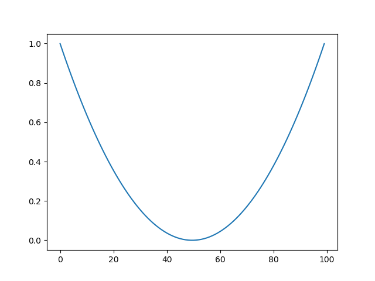
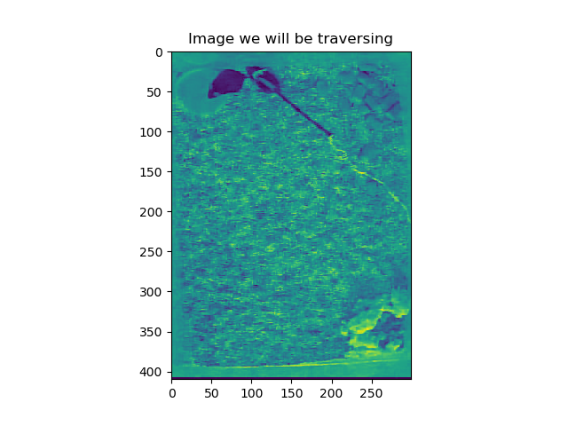
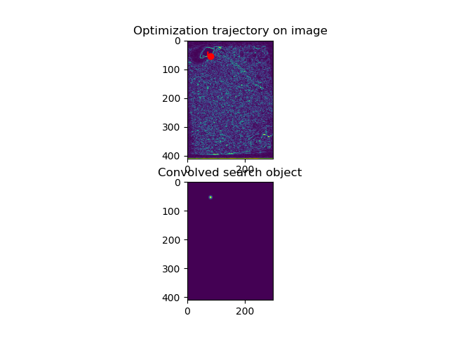
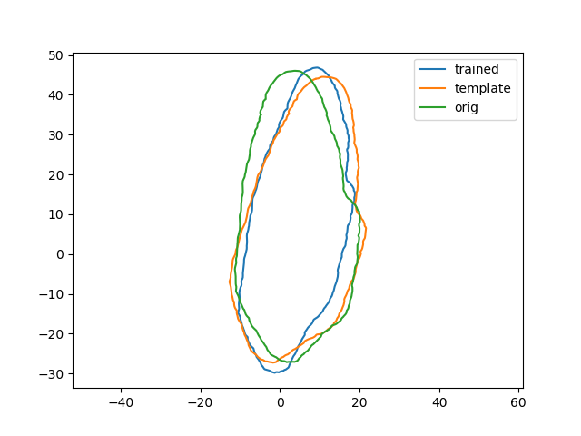

Script documentation for file: test_jax, Updated on:2020-10-30 13:51:39.358911
==============================================================================
 
  
**parent file: [from_contours_to_shape_model](./from_contours_to_shape_model.md)**
# Experimenting with JAX for automatic differentiation.

We'll work out three examples here: the first will simple minimum finding of a quadratic function, the second will be looking for intensity peaks in an image, and the third will be transforming one of our contours into a circle. These will be training/plausibility tests for an active shape model in pca fourier space.
## Quadratic Function

First let's try finding the minimum of a quadratic. This is the function we will optimize over:  
  

We see that the function reached a value of 0.015345534309744835, with x = 0.12387709319591522 after 100 iterations. This optimization was very easy to write, and involved no new api to learn.
## Find intensity peaks in an image.

We will next take an example image, and look at the edge intensity. While this is not a very useful example, we will traverse the image in search of intensity peaks. In order to have some more flexibility with this, we will convolve the search point with a gaussian, and array the resulting intensities in 2D. We then take the dot product of this 2D search element with the original image and feed this to the loss function.  
  

Here we use a gaussian convolved image of sigma = 20, and successfully localize a maximum of the sobel edge image.
### Find make a contour more circular

Our final check will be to take a contour object that has been parametrized as the fourier transform of pca weights, and train through the pca transformation. We can take gradients directly through the irfft transformation with JAX, but we will have to formulate the PCA transformation explicitly.   

I am learning that it's actually quite difficult to do gradient descent through a fourier transform. Initially, I tried to do gradient descent through the pca weights, optimizing the contour against a template contour that was a shifted and rotated version of it. This proved to be quite difficult. My hypothesis was that this was because having the tip of the nose off center was not a reachable position from the pca space. To address this, I tried to perform template matching to another real contour instead. This also proved too difficult. My next thought was that PCA was making certain configurations difficult to reach, so I tried scaling the step size by the eigenvalues, which did not work either. Finally I abandoned the pca and tried to take gradients through the fft. This seems to work better, but it still appears to be very sensitive. In particular, when I tried normalizing the step size by the harmonic series, this seemed to work a lot better, until I remembered that the whole thing is a concatenation of real and complex values. I then tried instead to concatenate the harmonic series scaling in a symmetric way to respect the structure of the harmonic series, but once again this looked to be flawed- because this is wrong: it should NOT be reversed. What is shown here is the version with scaled step sizes in fourier space. Although the idea of scaling the fourier components by their frequency makes sense in terms of fuzzy intuition, it's very weird, and we might want to consider alternative parametrizations in the future (consider the explicit ellipsoid parametrization by staib and duncan, for example). What is promising is that fitting to edges is actually a far more lenient task than fitting to a vectorized template, as was done here. Even if we don't take gradient steps in pc space, we can still regularize our cost function with our gaussian model likelihood to maintail plausibility.

After reviewing the Staib and Duncan paper, they show that it is sufficient to do gradient descent on the same representation that we currently are doing. They mention that taking gradients through their relative ellipse based parametrization was difficult due to the complexities of the gradient derivation. This could be interesting for us.

I think I finally got the step size to something that is internally consistent, by setting it equal to 1/the frequencies distributed over both x and y. This just seems like a hard optimization problem in general. I've also seen that it seems like it could be a good idea to restrict the gradients to the first few frequencies. These are all options we should keep in mind going forwards, but let's see if we can make our problem more specific. Let's try an alternative, where we convert the rotated template to a grayscale image and try to find edges there with a gaussian blurred contour as we did before. 

UPDATE 10/30: it looks like this optimization works fine, even if it looks like the cost is blowing up. We don't need to scale the frame rate by training, or anything. Working hypothesis is that we started getting into weird scaling stuff too early, we should have stuck to the fft. This is sufficient evidence for me to believe that if we train the fourier descriptors by gradient descent, we should be able to get somewhere.

Now we will develop these experiments into source code, and use them in the parent file (from_contours_to_shape_model.py)